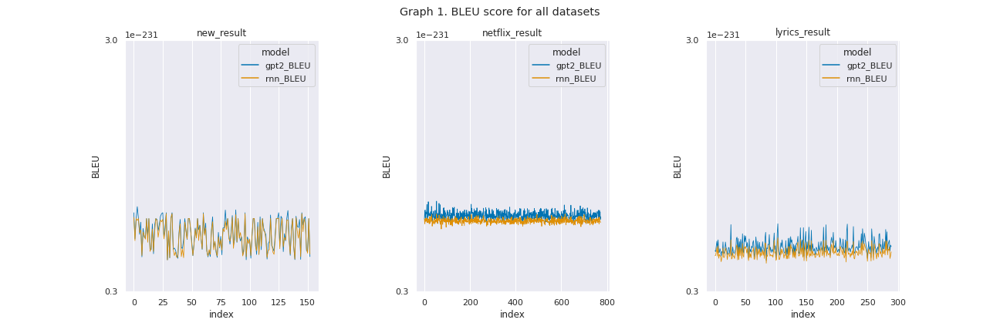
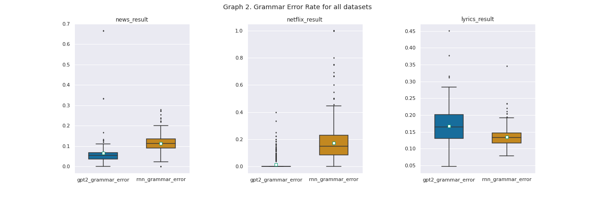
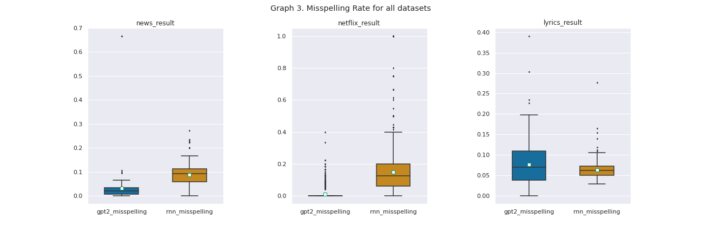

# README for Text Generation

# Text Generation with Transformer Networks

__Author:__ Shih-Chi Ma <br>
__Course:__ Information Systems Seminar <br>
__Institute:__ Humboldt University Berlin, Chair of Information Systems <br>
__Lecturer:__ Prof. Dr. Stefan Lessmann <br>
__Semester:__ WS 2021/22 <br>

## Contents of this repository

```
.
├── README.md                     # this readme file
├── Text_Generation.ipynb         # jupyter notebook on neural machine translation
├── Text_Generation.html          # jupyter notebook in HTML
├── fine_tune_data                # 3 preprocessed datasets that are used to fine tune the models
└── result_data                   # 3 results datasets from the experiments and graphs
```

## Contents of this README

```
1. Introduction
2. Literature Review
3. Experiments
4. Empirical Results
5. Discussion
6. Conclusion
References
```

## 1. Introduction

Natural language generation (NLG), a sub-field of natural language processing (NLP), is defined as the task of building software systems that can produce understandable texts in English or other human languages ([Reiter and Dale, 1997](#References)).
It is a vital tool in a wide range of natural language applications such as machine translation, text summarization
and question-answering. Recently, Transformer-based neural language models have shown to be very effective in leveraging large amounts of raw text corpora from online sources such as Wikipedia, search results, blogs, Reddit posts etc.([Celikyilmaz et al., 2020](#References)). On February 14th 2019, GPT-2 ([Radford et al., 2019](#References)) surprised the scientific community with an impressively high-quality article about Ovid’s Unicorn, the model has shown the ability to generate long texts that are almost indistinguishable from human-generated texts
([Uchendu et al., 2020](#References)).

On that account, the purpose of this paper is to apply python implementations for transformer-based text generation model and compare the generated text with other architectures. In the experimental setup, we included the GPT2 model published by OpenAI as the transformer model and a recurrent neural network (RNN) as the benchmark model. The two models are fine-tuned on three different datasets: Netflix description, Pop-Song Lyrics, and Business News.

## 2. Literature Review

NLG techniques range from simple template-based systems to machine-learned systems. Earlier template-based models ([Ono et al., 1994](#References), [Marcu, 1997](#References), [Stede and Umbach, 1998](#References)) have focused on modeling discourse structures and learning representations of relations between text units for text generation
([Celikyilmaz et al., 2020](#References)). Following this earlier work, with the availability of large datasets and corpus, several NLG researchers have focused on data-driven representation learning ([Gatt et al., 2007](#References), [Mairesse et al., 2010](#References), [Konstas and Lapata, 2013](#References)).

More recent work has shifted towards learning representations with the use of deep neural network (DNN) models ([Celikyilmaz et al., 2020](#References)), including RNNs (popular choices include LSTM ([Hochreiter and Schmidhuber, 1997](#References)) and GRU ([Chung et al., 2014](#References)). Most recently, Transformer architectures ([Vaswani et al., 2017](#References)) that incorporate the encoder-decoder structure and self attention mechanism are the new state-of-the-art NLG systems.

In their paper, Holtzman et al. categorized text generation tasks into directed generation and open-ended generation
[Holtzman et al., 2019](#References), where directed generation include applications like machine translation ([Bahdanau et al., 2014](#References)), summarization ([Nallapati et al., 2016](#References)), and data-to-text generation ([Wiseman et al., 2017](#References)), and open-ended generation includes conditional story generation and contextual text continuation. Unlike in directed generation settings, there is a considerable degree of freedom in the development of the story for open-ended generation. Typically, prompts generated by models or written by humans can only be used to provide a rough guide or starting point for the generated text ([Keskar et al., 2019](#References)), and controllability over the generation output is in general lacking.

This arouses the academic interests in controllable text generation, especially seeing the success in the degree
of control available image generation ([Chen et al., 2016](#References), [Paige et al., 2017](#References), [Lample et al., 2017](#References)). For example, Peng et al. proposed an analyze-to-generate framework that enables controllable story generation ([Peng et al., 2018](#References)). In this pilot study, the researchers explored the control on ending valence and story line for both style-level and content-level elements. Furthermore, CTRL model released in 2019 [Keskar et al., 2019](#References) incorporated ”control codes” that govern style, content, and task-specific behavior into the training process. And these codes allow users to explicitly specify domain, entities, relationships between entities, dates, and task-specific behavior.

On the other hand, there’s also a large body of research on avoiding neural text degeneration. Generated text in open-ended applications has been observed to be dull, with high frequency tokens used too often and interesting content words used too rarely ([Holtzman et al., 2019](#References)), which results in the repetition at token, phrase, and sentence levels ([Welleck et al., 2019](#References)). These issues were not resolved with the increase of either training data or model size, as the same problem occurs also in the large-scale GPT2 model ([Radford et al., 2019](#References)). Several methods have hence been proposed: Unlikelihood Training introduced by Welleck et al. forces unlikely generations to be assigned lower probability by the model and yields a result of less repetitive text while maintaining perplexity ([Welleck et al., 2019](#References)); Nucleus Sampling truncates the tail of the probability distribution and samples only from the dynamic nucleus of tokens containing the vast majority of the probability mass. With this approach, they achieved both high-quality and diverse text.

## 3. Experiments

**[Important Notes on (running) the Experiment]**
1.  Due to resourse limit on runtime and GPU memory, make sure to have a whole new runtime set up before running the notebook for each dataset. On top of that, it is recommended to save the progress and restart the runtime occasionally, otherwise the runtime might stop automatically. Some good cutting points are as follow: 
    1. After the gpt2 model is trained.
    2. After the generation results are produced.
2. In order to keep the notebook neat, we only show the code on the model part for one dataset, but re-running the cells with a simple comment in/out of the `df_name` will produce results for the other two datasets. In addition, the result files are also uploaded on the github website if skipping running the model part is desired.

In our experimental setup, we include two models: GPT2 and RNN. The models are going to be fine-tuned on three datasets: Business News, Netflix Description and Pop-song Lyrics. Below is an overview on the experiment structure.

**Main Steps**
- Load in packages and the datasets
- Model
    - GPT2
        - Prepare the dataset and build ``TextDataset``
        - Load the pre-trained GPT-2 model and tokenizer
        - Start fine-tuning with ``Trainer``
        - Generate text
    - RNN
        - Load in previously built ``TextDataset``
        - Construct the simple RNN structure
        - Generate text
- evaluate the model
    - BLEU
    - Grammar Check


## 4. Empirical Results
BLEU score: 

Grammar Error Rate: 

Misspellings Rate: 


## 5. Discussion

From the empirical results, we can see that the BLEU scores from all models and all datasets are essentially zero. BLEU was originally developed to evaluate machine translation, with values closer to one representing more similar texts and to zero otherwise. The aim of BLEU score is to gauge the similarity between the generated and the reference text. Yet, given that the develpoment of the text is not controlled in random text generation, the generated text can be grammatically correct and makes perfect sense but still receives a bad score - due to the generation of a complete different content, as we see from the results of netflix-GPT2. Clearly, despite its popularity among natural language processing tasks, the metric cannot appropriately reflect the model performance in our case. Consequently, we utilized the [`language_tool_python`](https://pypi.org/project/language-tool-python/) package to measure how many grammar errors are carried by the generated text. On top of that, given that lyrics don't necesarrily have strict grammar structures, we took a subset of the grammar error, the number of misspelling, for a better understanding on the lyrics generation. 

With the rate of grammar errors and misspellings, we observed the followings. First, GPT2 outperfroms the RNN model for two out of three datasets, with the average rate of grammar errors and misspellings from the GPT2-generated text being lower than the RNN-generated one. Second, the performance of the generation highly depends on the fine-tuning dataset. The results from GPT2 show high variations in terms of grammatical structures, with netflix model comprising nearly no grammar mistakes and misspellings, and the lyrcis carrying a high rate of mistakes. Two highly possible reasons for this are the informal writing-style of lytics text and the mingling of non-English part of lyrics into the dataset. Both characteristics of the lyrics dataset give rise to the poor performance indication, whereas this doesn't necessarily mean the generation has low quality. Further research on a better metric for this kind of "loose-structured" and "mixed-language" text is needed to give a more objective judgement on the text quality.

## 6. Conclusion

Text generation is central to many NLP tasks, including machine translation, question answering and text summarization, and transformer-based neural language models trained on a sufficiently large and diverse dataset have shown to be very successful across many domains and datasets. The goal of this paper is to apply python implementations for transformer-based text generation model and compare the generated text with other architectures. In the paper, we included two models, GPT2 and a benchmark RNN, and three datasets: Netflix description, Pop-Song Lyrics, and Business News. To evaluate the generated text, we applied three metrics, including BLEU, grammar_error rate and misspelling rate. Due to the unsuitability of the BLEU score in our case, we mostly rely on the later two for the model performance.

The results from the experiment showcased that GPT2 outperfroms RNN on the news and netflix dataset, with the judgement for lyrics data being held back since the a grammar check on informal text could be inappropriate. And with its strong ability to pick up text style, GPT2 produced lyrics-alike text but was considered carrying many mistakes. Despite that, we see that for better-stuctured text like news or normal sentence like netflix description, GPT2 can surely deliver better text than the RNN model.


## References
[Bahdanau et al., 2014] 

&ensp;&ensp;&ensp; *Bahdanau, D., Cho, K., and Bengio, Y. (2014).
Neural machine translation by jointly learning to align and translate. arXiv
preprint arXiv:1409.0473.*

[Celikyilmaz et al., 2020] 

&ensp;&ensp;&ensp; *Celikyilmaz, A., Clark, E., and Gao, J. (2020).
Evaluation of text generation: A survey. arXiv preprint arXiv:2006.14799.*

[Chen et al., 2016] 

&ensp;&ensp;&ensp; *Chen, X., Duan, Y., Houthooft, R., Schulman, J.,
Sutskever, I., and Abbeel, P. (2016). Infogan: Interpretable representation
learning by information maximizing generative adversarial nets. Advances
in neural information processing systems, 29.*

[Chung et al., 2014] 

&ensp;&ensp;&ensp; *Chung, J., Gulcehre, C., Cho, K., and Bengio, Y. (2014).
Empirical evaluation of gated recurrent neural networks on sequence
modeling. arXiv preprint arXiv:1412.3555.*

[Gatt et al., 2007] 

&ensp;&ensp;&ensp; *Gatt, A., Van Der Sluis, I., and Van Deemter, K. (2007).
Evaluating algorithms for the generation of referring expressions using a
balanced corpus. Association for Computational Linguistics.*

[Hochreiter and Schmidhuber, 1997] 

&ensp;&ensp;&ensp; *Hochreiter, S. and Schmidhuber, J.
(1997). Long short-term memory. Neural computation, 9(8):1735–1780.*

[Holtzman et al., 2019] 

&ensp;&ensp;&ensp; *Holtzman, A., Buys, J., Du, L., Forbes, M., and Choi,
Y. (2019). The curious case of neural text degeneration. arXiv preprint
arXiv:1904.09751.*

[Keskar et al., 2019] 

&ensp;&ensp;&ensp; *Keskar, N. S., McCann, B., Varshney, L. R., Xiong, C.,
and Socher, R. (2019). Ctrl: A conditional transformer language model
for controllable generation. arXiv preprint arXiv:1909.05858.*

[Konstas and Lapata, 2013] 

&ensp;&ensp;&ensp; *Konstas, I. and Lapata, M. (2013). A global
model for concept-to-text generation. Journal of Artificial Intelligence
Research, 48:305–346.*

[Lample et al., 2017] 

&ensp;&ensp;&ensp; *Lample, G., Zeghidour, N., Usunier, N., Bordes, A.,
Denoyer, L., and Ranzato, M. (2017). Fader networks: Manipulating
images by sliding attributes. Advances in neural information processing
systems, 30.*
[Mairesse et al., 2010] 

&ensp;&ensp;&ensp; *Mairesse, F., Gasic, M., Jurcicek, F., Keizer, S.,
Thomson, B., Yu, K., and Young, S. (2010). Phrase-based statistical
language generation using graphical models and active learning. In Pro-
ceedings of the 48th Annual Meeting of the Association for Computational
Linguistics, pages 1552–1561.*

[Marcu, 1997]

&ensp;&ensp;&ensp; *Marcu, D. (1997). From discourse structures to text sum-
maries. In Intelligent Scalable Text Summarization.*

[Nallapati et al., 2016]

&ensp;&ensp;&ensp; *Nallapati, R., Zhou, B., Gulcehre, C., Xiang, B., et al.
(2016). Abstractive text summarization using sequence-to-sequence rnns
and beyond. arXiv preprint arXiv:1602.06023.*

[Ono et al., 1994] 

&ensp;&ensp;&ensp; *Ono, K., Sumita, K., Research, S. M., Center, D.,
Komukai-Toshiba-cho, T. C., et al. (1994). Abstract generation based on
rhetorical structure extraction. arXiv preprint cmp-lg/9411023.*

[Paige et al., 2017] 

&ensp;&ensp;&ensp; *Paige, B., van de Meent, J.-W., Desmaison, A., Good-
man, N., Kohli, P., Wood, F., Torr, P., et al. (2017). Learning disentangled
representations with semi-supervised deep generative models. Advances in
neural information processing systems, 30.*

[Peng et al., 2018] 

&ensp;&ensp;&ensp; *Peng, N., Ghazvininejad, M., May, J., and Knight, K.
(2018). Towards controllable story generation. In Proceedings of the First
Workshop on Storytelling, pages 43–49.*

[Radford et al., 2019] 

&ensp;&ensp;&ensp; *Radford, A., Wu, J., Child, R., Luan, D., Amodei, D.,
Sutskever, I., et al. (2019). Language models are unsupervised multitask
learners. OpenAI blog, 1(8):9.*

[Reiter and Dale, 1997] 

&ensp;&ensp;&ensp; *Reiter, E. and Dale, R. (1997). Building applied
natural language generation systems. Natural Language Engineering,
3(1):57–87.*

[Stede and Umbach, 1998] 

&ensp;&ensp;&ensp; *Stede, M. and Umbach, C. (1998). Dimlex: A
lexicon of discourse markers for text generation and understanding. In
COLING 1998 Volume 2: The 17th International Conference on Compu-
tational Linguistics.*

[Uchendu et al., 2020] 

&ensp;&ensp;&ensp; *Uchendu, A., Le, T., Shu, K., and Lee, D. (2020).
Authorship attribution for neural text generation. In Conf. on Empirical
Methods in Natural Language Processing (EMNLP).*

[Vaswani et al., 2017] 

&ensp;&ensp;&ensp; *Vaswani, A., Shazeer, N., Parmar, N., Uszkoreit, J.,
Jones, L., Gomez, A. N., Kaiser, Ł., and Polosukhin, I. (2017). Attention
is all you need. Advances in neural information processing systems, 30.*

[Welleck et al., 2019] 

&ensp;&ensp;&ensp; *Welleck, S., Kulikov, I., Roller, S., Dinan, E., Cho, K.,
and Weston, J. (2019). Neural text generation with unlikelihood training.
arXiv preprint arXiv:1908.04319.*

[Wiseman et al., 2017]

&ensp;&ensp;&ensp; *Wiseman, S., Shieber, S. M., and Rush, A. M.
(2017). Challenges in data-to-document generation. arXiv preprint
arXiv:1707.08052.*
